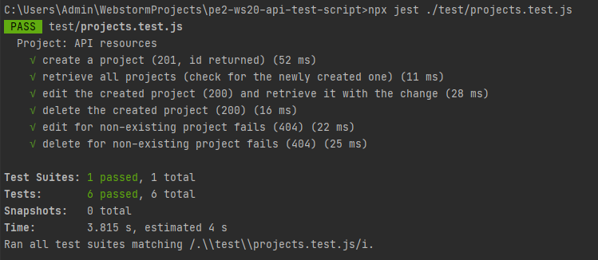
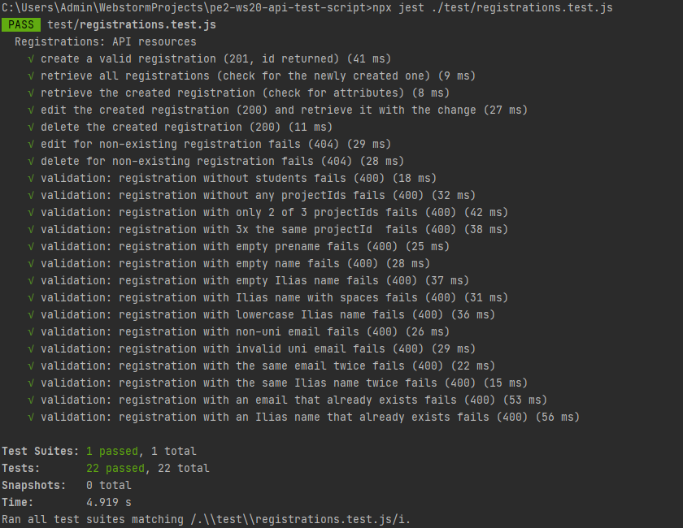
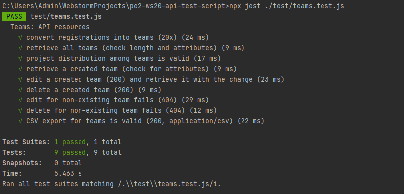

# PE II WS20/21: Project

> This repository contains example projects for a RESTful API with Spring Boot (`api/`) and for a single page application with Vue.js (`frontend/`).
> Please refer to the `README.md` files in the respective folders for concrete instructions.

## Quickstart
- Prerequisites : install node.js

Assuming all prerequisites are fulfilled, you can follow these instructions to get to know the application:
- Start the API by navigating into its folder and executing `mvnw spring-boot:run`.
- Now start the frontend by navigating into its folder and executing `npm install` and then `npm run serve`.
- It will host the UI at http://localhost:8081 which you can now also open in your browser.

## How will Teams be created?

- The teams are stored in a list sorted by the date of creation. After that, the minimum number of teams per project is determined. We then assign teams one by one to the project as long as the assignments of a project do not equal this certain number. The rest of the teams are assigned projects on the condition that no project is assigned twice.

- To be able to create the teams you don't send a request body in **POST/team-allocation.**

## Important Use Cases :

1. ***Projects*** : In the project view it is possible to add, edit an delete projects.
2. ***Registrations*** : In the Registration View it is possible to submitt a registration. One should first add students, which can also be edited afterwards and also deleted. Then you choose the projects according to their popularity. Then a summary is displayed, where you should press the submit registration button.
In the ***Submitted Registrations view***, you can edit the registrations by inserting or deleting students or editing them. The order of the projects can also be changed. The registration can also be deleted.
3. ***Teams*** : in the **Teams view** a table is filled with all teams, only when you press generate teams. These teams can be edited or deleted. On this view there is a button labeled "Download CSV". When you press it, all teams will be transferred to a CSV file which will be downloaded.

## Separation of the views of the course instructors and the students 
- In the sidebar, the separation of the views of  course instructors and course instructors views is present. The views intended for the course instructor are at the top with a label **Only for Course Instructors**. This also occurs with the students, there is the label **Only for Students**.

## Test Script
***The three tests run successfully individually, but the complete sequential test suite fails. Here are 3 screenshots of the results of the individual running tests***

**1. Test Projects** :

**2. Test Registrations** :

**3. Test Teams** :

